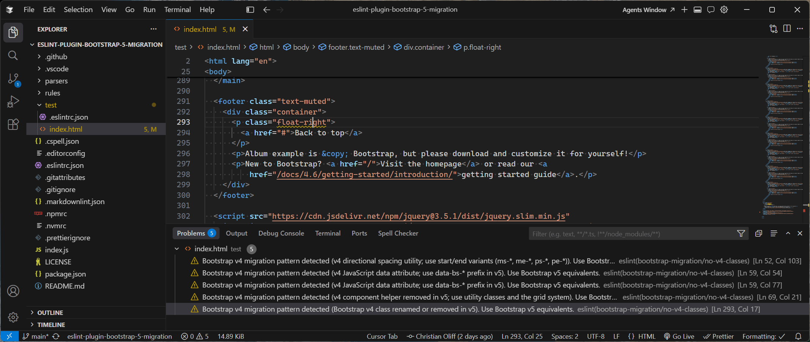

# eslint-plugin-bootstrap-5-migration

[](https://github.com/coliff/eslint-plugin-bootstrap-5-migration) [](LICENSE)

ESLint rules that flag **Bootstrap v4** class names, component classes, and `data-*` attribute values so you can migrate templates toward **Bootstrap v5** conventions. Reports are tied to actionable hints; many patterns include an automatic fix.

## Why use this?

Upgrading markup across a large codebase is easy to do incompletely. This plugin scans each file’s source (skipping YAML front matter and inline `<script>` / `<style>` blocks so those regions are not flagged) and warns where legacy v4 patterns remain - directional spacing classes, renamed utilities, removed form helpers, and outdated `data-*` attributes.

## Requirements

- **ESLint** `>= 8.57.1` (peer dependency)

## Installation

The package is not published to npm yet. Install from GitHub (pick your package manager):

```bash
npm install --save-dev github:coliff/eslint-plugin-bootstrap-5-migration
```

```bash
pnpm add -D github:coliff/eslint-plugin-bootstrap-5-migration
```

## Configuration

ESLint resolves the short plugin name **`bootstrap-migration`** from the package name `eslint-plugin-bootstrap-5-migration`.

### Flat config (`eslint.config.js` / `eslint.config.mjs`)

```javascript
import bootstrapMigration from "eslint-plugin-bootstrap-5-migration";

export default [
  {
    files: ["**/*.{cjs,html,js,jsx,mjs,tsx,vue}"],
    plugins: {
      "bootstrap-migration": bootstrapMigration,
    },
    rules: {
      "bootstrap-migration/no-v4-classes": "warn",
    },
  },
];
```

Use `"error"` instead of `"warn"` if you want the rule to fail CI.

### Legacy `.eslintrc.*` (ESLint 8)

```json
{
  "plugins": ["bootstrap-migration"],
  "rules": {
    "bootstrap-migration/no-v4-classes": "warn"
  }
}
```

Point the `files` / `overrides` entry at the templates you want checked (HTML, Vue SFCs, JSX, etc.). For raw `.html` files you may need a plugin such as [`eslint-plugin-html`](https://www.npmjs.com/package/eslint-plugin-html) so ESLint parses those files.

## VS Code: real-time linting and autofix on save

With the [ESLint extension](https://marketplace.visualstudio.com/items?itemName=dbaeumer.vscode-eslint) installed, problems update as you edit. To run ESLint fixes when you save (for HTML and JS/TS), and to ensure ESLint validates those languages, add the following to your workspace or user `settings.json`:

```json
{
  "[html][javascript][typescript]": {
    "editor.codeActionsOnSave": {
      "source.fixAll.eslint": "explicit"
    }
  },
  "eslint.validate": ["html", "javascript"]
}
```



`source.fixAll.eslint` set to `"explicit"` runs only when you use **Save** or **Save All** (not on every automatic save). Adjust `eslint.validate` if you use additional file types this plugin checks.

## Rules

| Rule ID                                   | Description       |
| ----------------------------------------- | ----------------- |
| [`no-v4-classes`](rules/no-v4-classes.js) | Flags v4 classes. |

Rule messages reference the same migration hints as in code; auto-fix is applied only when a safe one-to-one replacement is defined.

## License

MIT © [Christian Oliff](https://christianoliff.com). See [LICENSE](LICENSE).
